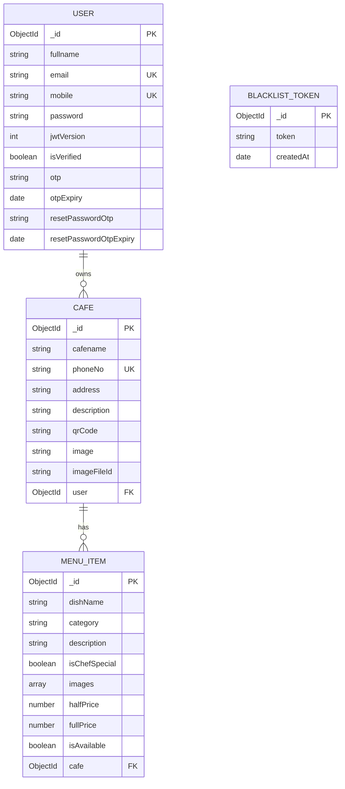

<p align="center">
  
</p>

<h1 align="center">🍽️ ScanDine — Smart QR Menu Platform</h1>

<p align="center">
  <strong>A production-grade, full-stack SaaS platform that empowers small cafés and restaurants to go digital with QR-based menus — no app downloads required.</strong>
</p>

<p align="center">
  <a href="https://scandine-nu.vercel.app">🌐 Live Demo</a> •
  <a href="https://scandine-ziec.onrender.com/health">⚙️ API Health</a> •
  <a href="#features">✨ Features</a> •
  <a href="#architecture">🏛️ Architecture</a> •
  <a href="#tech-stack">🛠️ Tech Stack</a>
</p>

<p align="center">
  
  
  
  
  
  
  
  
  
  
  
</p>

---

## 📌 Problem Statement

Small cafés and restaurants waste money and time reprinting paper menus every time prices or items change. Customers are often stuck with outdated, damaged, or hard-to-read menus. There's no affordable, no-code digital solution tailored for small food businesses.

## 💡 Solution

**ScanDine** provides a self-service platform where café owners can:

1. **Register & create** a café profile in minutes  
2. **Build a digital menu** with images, categories, pricing, and availability toggles  
3. **Generate a unique QR code** that customers scan to view the live, always-updated menu  
4. **Update the menu in real-time** — no reprinting, no downtime  

Customers simply **scan → browse → order** — zero app downloads, zero friction.

---

## ✨ Features

### 🧑‍💼 For Café Owners (Dashboard)
| Feature | Description |
|---------|-------------|
| **User Authentication** | Email/password registration with OTP email verification, login, forgot/reset password |
| **Café Profile Management** | Create & edit café details (name, address, phone, description) with image upload |
| **Full Menu CRUD** | Add, edit, delete menu items with multi-image upload (up to 5 per item), half/full pricing |
| **Category System** | 8 predefined categories — Starters, Main Course, Dessert, Drinks, Snacks, Breakfast, Coffee & Tea, Beverages |
| **Availability Toggle** | Instantly mark items as available/unavailable without deleting them |
| **Chef's Special Flag** | Highlight signature dishes with a special badge |
| **QR Code Generator** | Generate, download (PNG/SVG), and print a unique QR code linked to the live menu |
| **Account Management** | View profile, sign out, and full account deletion with cascading cleanup |

### 👥 For Customers (Public)
| Feature | Description |
|---------|-------------|
| **QR Scan → Menu** | Scan a QR code with any smartphone camera — opens the menu instantly in the browser |
| **Café Discovery** | Search and browse all registered cafés by name or city |
| **Beautiful Menu View** | Categorized menu with images, pricing, availability badges, and chef's special indicators |
| **No Login Required** | Customers access menus without signing up or downloading any app |
| **Dark Mode** | Full dark/light theme toggle across the entire application |

### 🔒 Security & Production Features
| Feature | Implementation |
|---------|---------------|
| **Authentication** | JWT stored in HTTP-only cookies with 7-day expiry |
| **Token Blacklisting** | Logout invalidates tokens via a blacklist collection (auto-expire 24h) |
| **Password Security** | bcrypt hashing with salt rounds; `jwtVersion` invalidates all sessions on password reset |
| **Rate Limiting** | Tiered rate limits — public (1000/15min), auth (20/15min), login (5/5min), OTP (3/10min) |
| **Input Validation** | Server-side validation with express-validator + client-side Zod schemas |
| **Security Headers** | Helmet middleware for XSS, clickjacking, and MIME-type protection |
| **CORS** | Strict origin allowlist — only the frontend domain and localhost |
| **Graceful Shutdown** | Handles SIGTERM for zero-downtime deployments |

---

## 🏛️ Architecture

```
┌─────────────────────────────────────────────────────────────────┐
│                        CLIENTS                                  │
│   📱 Customer (QR Scan)     💻 Café Owner (Dashboard)           │
└──────────────┬──────────────────────────┬───────────────────────┘
               │                          │
               ▼                          ▼
┌──────────────────────────────────────────────────────────────────┐
│                    FRONTEND (Vercel)                              │
│  React 18 + TypeScript + Vite + TailwindCSS + Radix UI          │
│  ┌──────────┐ ┌──────────┐ ┌──────────┐ ┌──────────────────┐   │
│  │  Landing  │ │  Search  │ │   Menu   │ │    Dashboard     │   │
│  │   Page    │ │  Cafés   │ │ Display  │ │  (Auth Required) │   │
│  └──────────┘ └──────────┘ └──────────┘ └──────────────────┘   │
│  ┌──────────┐ ┌──────────┐ ┌──────────┐ ┌──────────────────┐   │
│  │  SignUp   │ │  SignIn  │ │ Verify   │ │   QR Code Page   │   │
│  │          │ │          │ │   OTP    │ │  (Generate/DL)   │   │
│  └──────────┘ └──────────┘ └──────────┘ └──────────────────┘   │
│  React Query · Axios · Framer Motion · React Router v6          │
└──────────────────────────────┬───────────────────────────────────┘
                               │  HTTPS (REST API)
                               ▼
┌──────────────────────────────────────────────────────────────────┐
│                    BACKEND (Render / EC2)                         │
│  Express 5 + Node.js ≥ 20 (ES Modules)                          │
│                                                                  │
│  ┌─────────────────────────────────────────────────────────┐    │
│  │  Middleware Pipeline                                     │    │
│  │  Morgan → Helmet → CORS → Rate Limiter → Cookie Parser  │    │
│  └─────────────────────────────────────────────────────────┘    │
│                                                                  │
│  ┌──────────────┐  ┌──────────────┐  ┌──────────────┐          │
│  │  User Routes  │  │  Café Routes │  │  Menu Routes │          │
│  │  /api/v1/     │  │  /api/v1/    │  │  /api/v1/    │          │
│  │  users/*      │  │  cafe/*      │  │  menu/*      │          │
│  └──────┬───────┘  └──────┬───────┘  └──────┬───────┘          │
│         ▼                 ▼                  ▼                   │
│  ┌──────────────┐  ┌──────────────┐  ┌──────────────┐          │
│  │  Controllers  │  │  Validators  │  │  Middleware   │          │
│  │              │  │ (express-    │  │ (auth +      │          │
│  │              │  │  validator)  │  │  cafeAuth)   │          │
│  └──────┬───────┘  └──────────────┘  └──────────────┘          │
│         ▼                                                        │
│  ┌──────────────────────────────────────────────────────┐       │
│  │  Services                                             │       │
│  │  📧 Email (Nodemailer + Google OAuth2)                │       │
│  │  🖼️  Storage (ImageKit — upload/delete)               │       │
│  │  📊 Logging (Winston + Morgan)                        │       │
│  └──────────────────────────────────────────────────────┘       │
└──────────────────────────────┬───────────────────────────────────┘
                               │
               ┌───────────────┼───────────────┐
               ▼               ▼               ▼
        ┌────────────┐  ┌────────────┐  ┌────────────┐
        │  MongoDB   │  │  ImageKit  │  │  Gmail     │
        │  Atlas     │  │  CDN       │  │  OAuth2    │
        │            │  │            │  │            │
        │ Users      │  │ Café logos │  │ OTP emails │
        │ Cafés      │  │ Menu item  │  │ Password   │
        │ Menus      │  │ images     │  │ resets     │
        │ Blacklist  │  │            │  │            │
        └────────────┘  └────────────┘  └────────────┘
```

---

## 🛠️ Tech Stack

### Frontend

| Layer | Technology | Purpose |
|-------|-----------|---------|
| **Framework** | React 18 + TypeScript | Component-based UI with type safety |
| **Build Tool** | Vite + SWC | Lightning-fast HMR and builds |
| **Styling** | TailwindCSS 3 + tailwindcss-animate | Utility-first CSS with animations |
| **UI Library** | Radix UI (49 components) + shadcn/ui | Accessible, headless component primitives |
| **State/Data** | TanStack React Query + Axios | Server-state management and HTTP client |
| **Routing** | React Router v6 | Client-side routing with 11 routes |
| **Animations** | Framer Motion | Smooth page transitions and micro-interactions |
| **3D** | Three.js + React Three Fiber | 3D visual elements |
| **Forms** | React Hook Form + Zod | Performant form handling with schema validation |
| **Notifications** | React Hot Toast + Sonner | Beautiful toast notifications |
| **Hosting** | Vercel | Edge-optimized static hosting with SPA rewrites |

### Backend

| Layer | Technology | Purpose |
|-------|-----------|---------|
| **Runtime** | Node.js ≥ 20 (ES Modules) | Modern JavaScript runtime |
| **Framework** | Express 5 | Web server with async error handling |
| **Database** | MongoDB (Mongoose ODM) | Document database with schema validation |
| **Auth** | JWT + bcrypt | Stateless auth with password hashing |
| **File Storage** | ImageKit | CDN-backed image upload, transform, and delivery |
| **Email** | Nodemailer + Google OAuth2 | OTP delivery and transactional emails |
| **QR Generation** | qrcode | Server-side QR code generation as base64 |
| **Validation** | express-validator | Request body/params/query validation |
| **Security** | Helmet + CORS + express-rate-limit | HTTP header security, origin control, rate limiting |
| **Logging** | Winston (app) + Morgan (HTTP) | Structured logging with file/console transports |
| **Process Mgmt** | PM2 | Production process management with auto-restart |
| **Hosting** | Render / AWS EC2 | Scalable backend hosting |

### DevOps & CI/CD

| Tool | Purpose |
|------|---------|
| **GitHub Actions** | Automated deployment pipeline (push to `master` → SSH → EC2 → PM2 restart) |
| **Vercel** | Automatic frontend deployments on push |
| **ESLint + Prettier** | Code quality and formatting enforcement |

---

## 📁 Project Structure

```
scandine_project/
├── Frontend/                         # React SPA (Vite + TypeScript)
│   ├── client/
│   │   ├── App.tsx                   # Root component with routing
│   │   ├── global.css                # Global styles + Tailwind
│   │   ├── pages/
│   │   │   ├── Index.tsx             # Landing page with auth-aware nav
│   │   │   ├── Search.tsx            # Café discovery with live search
│   │   │   ├── MenuDisplay.tsx       # Public menu viewer (QR destination)
│   │   │   ├── Dashboard.tsx         # Owner dashboard (CRUD + café mgmt)
│   │   │   ├── QRCodePage.tsx        # QR generator + download (PNG/SVG)
│   │   │   ├── SignUp.tsx            # Registration with validation
│   │   │   ├── SignIn.tsx            # Login with error handling
│   │   │   ├── VerifyOTP.tsx         # Email OTP verification
│   │   │   ├── ForgotPassword.tsx    # Password reset flow
│   │   │   ├── About.tsx             # About + developer profile
│   │   │   ├── Contact.tsx           # Contact form
│   │   │   └── NotFound.tsx          # 404 page
│   │   ├── components/ui/            # 49 Radix-based UI components
│   │   ├── hooks/                    # Custom hooks (dark mode, toast, mobile)
│   │   └── lib/api.ts               # Axios instance with env-based URL
│   ├── vite.config.ts                # Build config + dev proxy
│   ├── tailwind.config.ts            # Custom theme + animations
│   ├── vercel.json                   # SPA rewrite rules
│   └── package.json
│
├── Backend/                          # Express 5 REST API
│   ├── index.js                      # Server entry with graceful shutdown
│   ├── src/
│   │   ├── app.js                    # Express app (middleware, routes, error handler)
│   │   ├── config/
│   │   │   ├── config.js             # Environment variable loader + validation
│   │   │   └── db.js                 # MongoDB Atlas connection
│   │   ├── controllers/
│   │   │   ├── user.controller.js    # Auth, profile, account deletion
│   │   │   ├── cafe.controller.js    # CRUD, image upload, QR generation
│   │   │   └── menu.controller.js    # CRUD, multi-image upload, availability
│   │   ├── middlewares/
│   │   │   ├── auth.js               # JWT verify + blacklist check
│   │   │   └── cafeAuth.js           # Auth + café ownership verification
│   │   ├── models/
│   │   │   ├── user.model.js         # User schema (with cascading delete)
│   │   │   ├── cafe.model.js         # Café schema (with menu cleanup)
│   │   │   ├── menu.model.js         # Menu schema (images, pricing, availability)
│   │   │   └── blacklistToken.model.js
│   │   ├── routes/                   # RESTful route definitions
│   │   ├── services/
│   │   │   ├── email.service.js      # Nodemailer + Google OAuth2
│   │   │   └── storage.service.js    # ImageKit upload/delete helpers
│   │   ├── validators/               # express-validator rules
│   │   ├── utils/                    # AppError, email templates, multer config
│   │   └── loggers/                  # Winston + Morgan setup
│   ├── .github/workflows/
│   │   └── deploy.yml                # CI/CD: GitHub Actions → EC2 via SSH
│   └── package.json
│
└── README.md                         # ← You are here
```

---

## 🖥️ Live Deployment

| Service | URL | Platform |
|---------|-----|----------|
| **Frontend** | [scandine-nu.vercel.app](https://scandine-nu.vercel.app) | Vercel |
| **Backend API** | [scandine-ziec.onrender.com](https://scandine-ziec.onrender.com/health) | Render |
| **Database** | MongoDB Atlas | AWS (Managed) |
| **Image CDN** | ImageKit | Global CDN |

---

## 🗄️ Database Schema



---

## 🔌 API Reference

**Base URL:** `https://scandine-ziec.onrender.com/api/v1`

### Authentication Flow

```
Register → Receive OTP Email → Verify OTP → Login → JWT Cookie → Access Dashboard
```

### Endpoints Summary

<details>
<summary><strong>👤 Users — <code>/api/v1/users</code></strong></summary>

| Method | Endpoint | Auth | Description |
|--------|----------|------|-------------|
| `POST` | `/register` | Public | Register with email, mobile, password |
| `POST` | `/login` | Public | Login → sets HTTP-only JWT cookie |
| `POST` | `/verify-otp` | Public | Verify email with 6-digit OTP |
| `POST` | `/resend-otp` | Public | Resend verification OTP |
| `POST` | `/forget-password` | Public | Request password reset OTP |
| `POST` | `/reset-password` | Private | Reset password + invalidate all sessions |
| `GET` | `/me` | Private | Get authenticated user |
| `GET` | `/dashboard/profile` | Private | Get profile for dashboard |
| `POST` | `/logout` | Private | Logout + blacklist token |
| `DELETE` | `/delete` | Private | Delete account + cascade cleanup |

</details>

<details>
<summary><strong>🏪 Cafés — <code>/api/v1/cafe</code></strong></summary>

| Method | Endpoint | Auth | Description |
|--------|----------|------|-------------|
| `POST` | `/createCafe` | Private | Create a new café |
| `GET` | `/showCafe` | Private | Get your café details |
| `PUT` | `/updateCafe` | Cafe Owner | Update café details + image |
| `POST` | `/upload-image` | Cafe Owner | Upload café logo |
| `GET` | `/generate-qr` | Cafe Owner | Generate QR code (base64) |
| `GET` | `/public-cafes` | Public | List all cafés |

</details>

<details>
<summary><strong>📋 Menu — <code>/api/v1/menu</code></strong></summary>

| Method | Endpoint | Auth | Description |
|--------|----------|------|-------------|
| `POST` | `/` | Cafe Owner | Add a menu item |
| `GET` | `/my-menu` | Cafe Owner | Get all items for your café |
| `PUT` | `/:menuItemId` | Cafe Owner | Update a menu item |
| `DELETE` | `/:menuItemId` | Cafe Owner | Delete a menu item |
| `POST` | `/upload-images/:menuItemId` | Cafe Owner | Upload images (max 5) |
| `PUT` | `/availability/:id` | Cafe Owner | Toggle item availability |
| `GET` | `/:cafeId` | Public | Get menu items by café |
| `GET` | `/public/:cafeId` | Public | Get public menu |

</details>

---

## 🚀 Getting Started

### Prerequisites

- **Node.js** ≥ 20
- **MongoDB** instance (local or [Atlas](https://www.mongodb.com/atlas))
- **ImageKit** account ([imagekit.io](https://imagekit.io))
- **Google Cloud** project with OAuth2 credentials (for email)

### 1. Clone the Repository

```bash
git clone https://github.com/dhakar12/ScanDine.git
cd ScanDine
```

### 2. Backend Setup

```bash
cd Backend
npm install

# Create environment file
cat > .env << EOF
NODE_ENV=development
PORT=3000
MONGO_URI=mongodb+srv://<user>:<password>@cluster.mongodb.net/<db>
JWT_SECRET=<your-secret-key>

# Email (Google OAuth2)
EMAIL_USER=your-email@gmail.com
GOOGLE_CLIENT_ID=<google-client-id>
GOOGLE_CLIENT_SECRET=<google-client-secret>
REFRESH_TOKEN=<google-oauth-refresh-token>

# Image Uploads
IMAGEKIT_PRIVATE_KEY=<imagekit-private-key>
EOF

# Start the backend
npm run dev
# → Server starts at http://localhost:3000
```

### 3. Frontend Setup

```bash
cd Frontend
npm install

# Create environment file
echo "VITE_API_BASE_URL=http://localhost:3000/api/v1" > .env.development

# Start the frontend
npm run dev
# → App starts at http://localhost:8080
```

---

## 🧪 Key Technical Decisions

| Decision | Rationale |
|----------|-----------|
| **JWT in HTTP-only cookies** | Prevents XSS token theft vs. localStorage approach |
| **Token blacklist with TTL** | Enables true logout while keeping JWT stateless; tokens auto-expire from blacklist |
| **`jwtVersion` on User model** | Password reset invalidates ALL active sessions across devices |
| **Cascading deletes via Mongoose hooks** | User deletion auto-cleans cafés → menu items → images (referential integrity) |
| **Tiered rate limiting** | Different thresholds for public (relaxed), auth (strict), login (very strict), OTP (extremely strict) |
| **ImageKit over S3** | Built-in CDN, real-time transformations, and generous free tier for image-heavy menus |
| **Express 5** | Native async error handling — no need for `express-async-errors` wrapper |
| **Vite + SWC** | 10–20x faster builds than Webpack + Babel |
| **Radix UI primitives** | Fully accessible (WAI-ARIA), unstyled components — complete design control |

---

## 🔐 Security Architecture

```
Client Request
       │
       ▼
┌─────────────────┐
│   Helmet        │  ← Security headers (XSS, Clickjack, MIME)
├─────────────────┤
│   CORS          │  ← Strict origin allowlist
├─────────────────┤
│   Rate Limiter  │  ← Tiered: 1000/20/5/3 per window
├─────────────────┤
│   Auth MW       │  ← JWT verify + blacklist check + jwtVersion match
├─────────────────┤
│   Validator     │  ← express-validator sanitization
├─────────────────┤
│   Controller    │  ← Business logic
└─────────────────┘
```

---

## 📊 Performance & UX Highlights

- ⚡ **Vite + SWC** build pipeline — sub-second HMR in development
- 🎨 **Dark mode** with persistent preference via custom `useDarkMode` hook
- 📱 **Fully responsive** — mobile-first design with Tailwind breakpoints
- 💫 **Framer Motion** animations — smooth page transitions and interactive feedback
- 🔄 **Optimistic UI** — React Query caching with background refetches
- 🖼️ **ImageKit CDN** — globally distributed, lazy-loaded menu images
- 📦 **Code splitting** — React Router lazy routes for reduced initial bundle
- 🎯 **Skeleton loading states** — polished loading UX across Dashboard and Search

---

## 🤝 Contributing

1. Fork the repository
2. Create a feature branch: `git checkout -b feature/your-feature`
3. Commit your changes: `git commit -m "feat: add your feature"`
4. Push to the branch: `git push origin feature/your-feature`
5. Open a Pull Request

Please run linting and formatting before submitting:

```bash
# Backend
cd Backend && npm run lint && npm run format

# Frontend
cd Frontend && npm run format.fix
```

---

## 👨‍💻 Author

<p align="center">
  <strong>Uday Dhakar</strong><br/>
  Full Stack Developer · IIIT Surat<br/><br/>
  <a href="https://www.linkedin.com/in/uday-dhakar-853501281/">
    
  </a>
  &nbsp;
  <a href="https://github.com/dhakar12">
    
  </a>
</p>

---

## 📄 License

This project is licensed under the [MIT License](./Backend/LICENSE).

---

<p align="center">
  <sub>Built with ❤️ for small businesses that deserve big tech.</sub>
</p>
